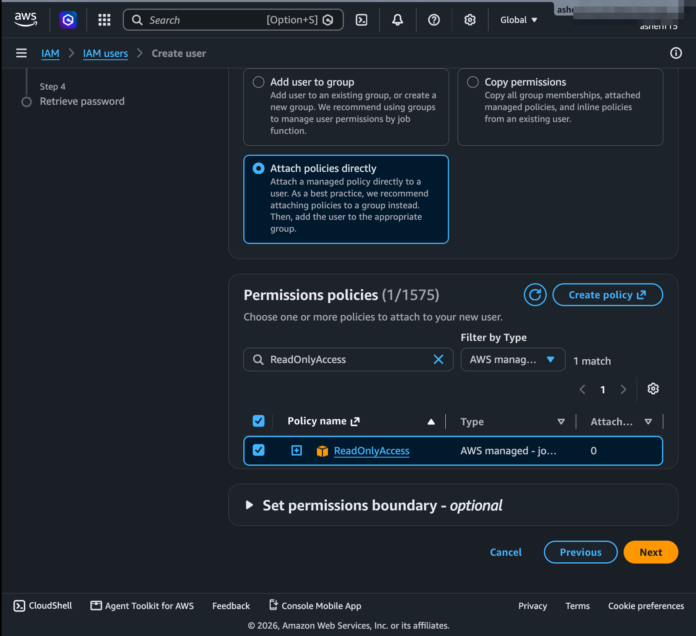
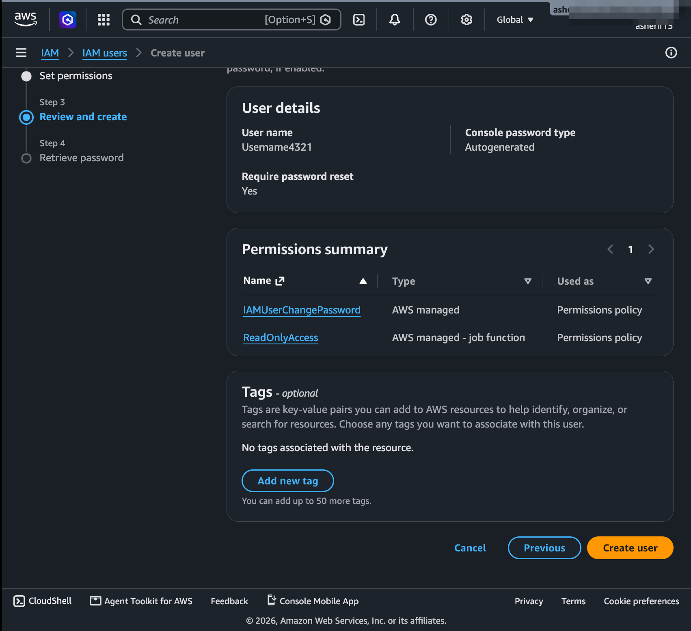
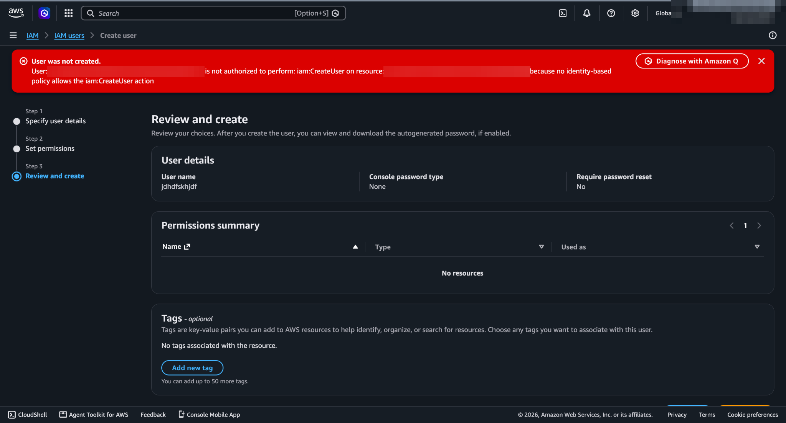

# Lab 01 — IAM Users & Read-Only Access

## Objective
Stop using the root account for daily work by creating an IAM user with console access, MFA, and the minimum permissions it needs.

## What I did
1. Created an IAM user with console access and an auto-generated password that must be reset at first sign-in
2. Attached the AWS-managed **`ReadOnlyAccess`** policy directly to the user
3. Enabled **MFA** on the user (Duo Mobile)
4. Signed out of root, signed in as the new user, and tried to create another IAM user

## Result — denied, as expected
The read-only user could browse IAM but was blocked from writing:

> `is not authorized to perform: iam:CreateUser … because no identity-based policy allows the iam:CreateUser action`

## Why it matters
- **Root is for break-glass only.** It can't be restricted by IAM policies, so day-to-day work belongs on a named IAM identity.
- **Implicit deny:** IAM denies everything by default. The error says *"no identity-based policy allows"* — nothing explicitly denied it; it simply wasn't granted.
- **MFA on every human user** blunts stolen-password attacks.

## What I'd do differently in production
- Grant permissions through **groups** (Lab 02) instead of attaching policies directly to users
- Use **IAM Identity Center (SSO)** with short-lived credentials instead of long-lived IAM users
- Prefer job-scoped policies over the broad `ReadOnlyAccess`, which can still read sensitive data across services
