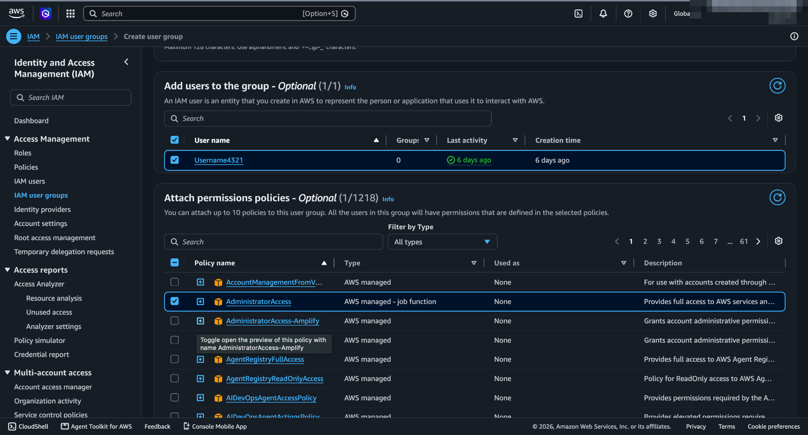
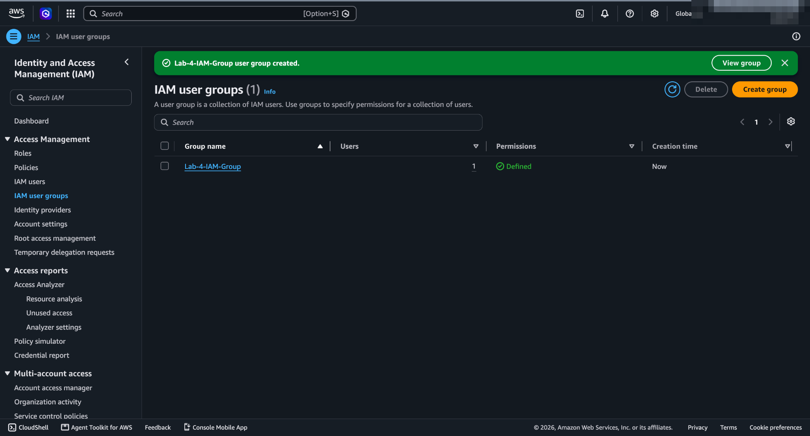
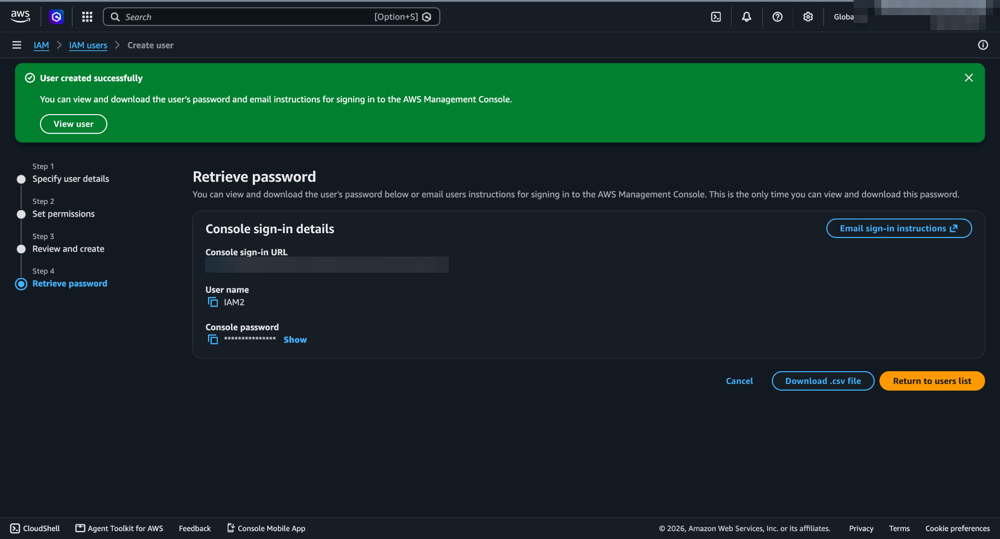

# Lab 02 — IAM Groups

## Objective
Manage permissions through **groups** rather than attaching policies to individual users.

## What I did
1. Created a user group and added the read-only user from [Lab 01](../01-iam-users/)
2. Attached **`AdministratorAccess`** to the group (not to the user)
3. Signed in as the user and repeated the action that failed in Lab 01 — creating an IAM user

## Result — now allowed
The same user that was denied `iam:CreateUser` in Lab 01 created a new user successfully. The only change was **group membership**.

## Why it matters
- **Permissions are the union of all attached policies.** The user now has `ReadOnlyAccess` (direct) + `AdministratorAccess` (via group), so the broader one wins.
- **Groups scale.** Onboarding = add to group; offboarding or role change = remove from group. No per-user policy sprawl to audit.

## What I'd do differently in production
- **Never hand out `AdministratorAccess` casually** — this lab used it to make the effect obvious. Real groups map to job functions (e.g., `network-admins`, `read-only-auditors`)
- Remove the leftover direct policy from Lab 01 so all permissions come from one place
- Require MFA for privileged groups with an `aws:MultiFactorAuthPresent` condition
