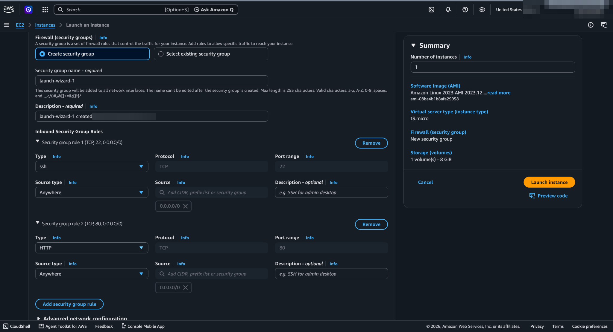
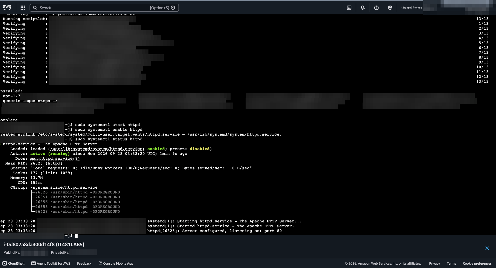
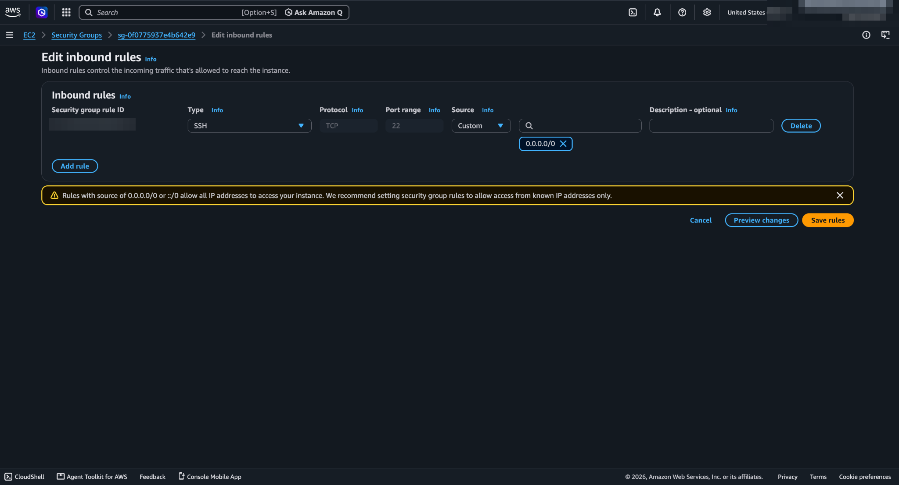
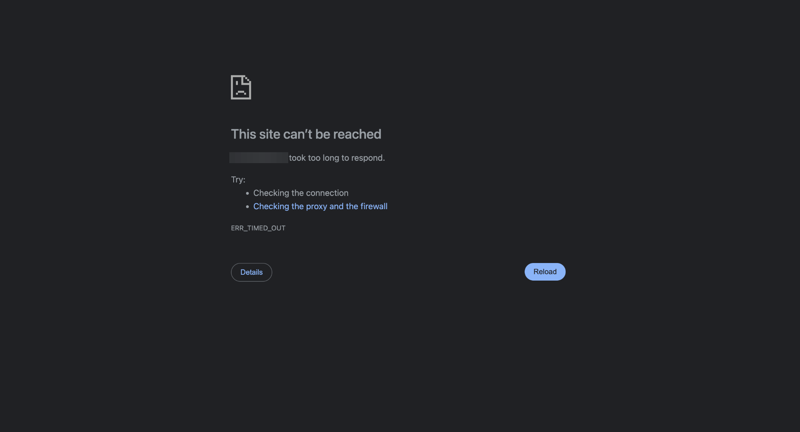

# Lab 03 — Securing EC2 with Security Groups

## Objective
Control access to a web server at the **instance level** and observe what happens when a rule is removed.

## What I did
1. Launched an Amazon Linux 2023 `t3.micro` instance with a security group allowing **SSH (22)** and **HTTP (80)**
2. Installed and started Apache:
   ```bash
   sudo yum update -y
   sudo yum install httpd -y
   sudo systemctl start httpd
   sudo systemctl enable httpd
   ```
3. Confirmed the site loaded from my browser
4. **Deleted the HTTP rule** → the site stopped loading
5. **Re-added the HTTP rule** → the site came back








## Diagnosis
With the HTTP rule gone, the browser showed **`ERR_TIMED_OUT`**, not "connection refused." Apache was still running — the security group was silently dropping packets before they reached the instance. A timeout points to a firewall; a refusal would point to the service.

## Why it matters
- Security groups are **stateful** and **allow-only**: anything not explicitly allowed is dropped, and responses to allowed traffic flow back automatically.
- Changes apply **immediately**, with no restart.

## What I'd do differently in production
- The lab opened SSH and HTTP to **`0.0.0.0/0`**. In production: SSH limited to an admin IP or removed in favor of **SSM Session Manager**, and the web server placed behind a **load balancer**, with the instance's security group allowing traffic only from the load balancer's security group
- Serve over **HTTPS (443)** with a certificate from ACM
