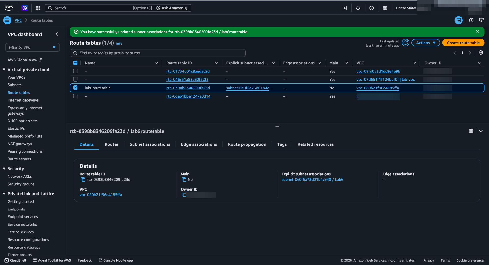
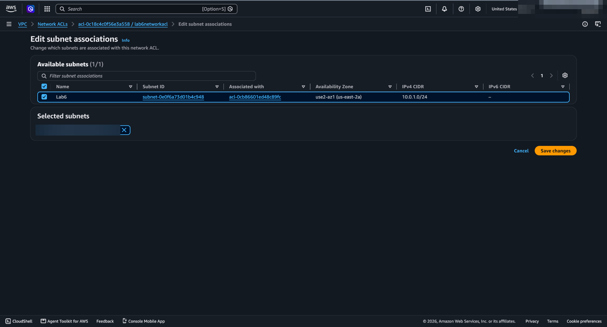
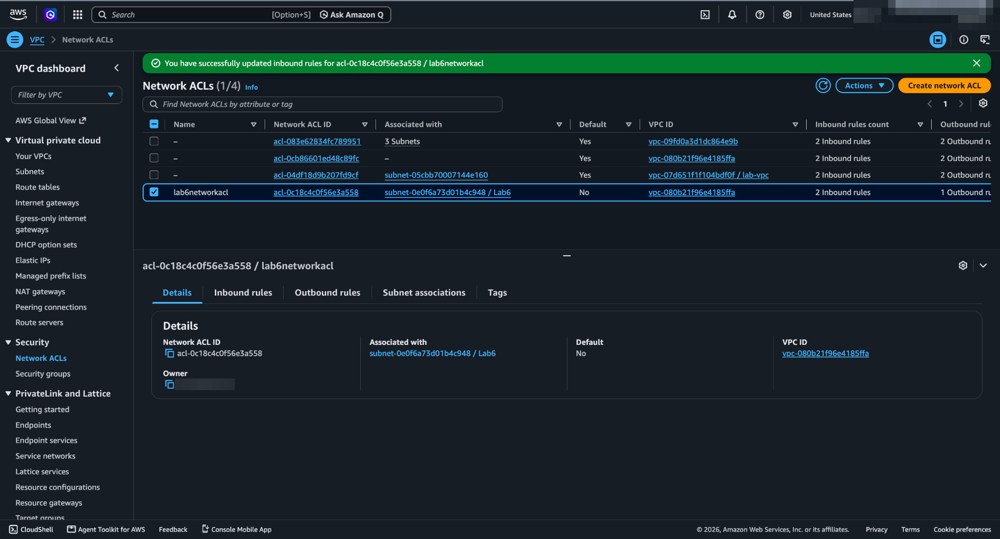

# Lab 04 — Securing Network Traffic with NACLs

## Objective
Add a second, **subnet-level** layer of network control with a Network ACL, and see it block traffic that the security group still allows.

## What I did
1. Built the network: a custom VPC (`10.0.0.0/16`), a public subnet (`10.0.1.0/24`) with auto-assigned public IPs, an internet gateway, and a route table with `0.0.0.0/0 → IGW` associated to the subnet
2. Launched an EC2 web server in the subnet and confirmed the test page loaded
3. Created a **custom Network ACL**, associated it with the subnet, and updated its inbound rules
4. Reloaded the page → **blocked** (`ERR_CONNECTION_TIMED_OUT`), even though the security group was unchanged

## Why it was blocked
The NACL list shows the custom NACL with inbound rules added but **only the default deny rule outbound**. NACLs are **stateless**: even if a request is allowed in, the server's response is a separate outbound flow (to the client's ephemeral port, 1024–65535) that needs its own allow rule. With no outbound allow, responses are dropped and the browser times out.

This is the key difference from Lab 03 — a security group would have let the response back automatically.

## Why it matters
- **Defense in depth:** NACLs guard the whole subnet, so a misconfigured security group on one instance isn't the only line of defense.
- NACLs support **explicit deny** rules, e.g. blocking a known-bad IP range for every instance in the subnet at once.
- Rules are evaluated **in number order, first match wins**, so rule numbering matters.

## What I'd do differently in production
- Leave gaps in rule numbers (100, 200, 300…) so rules can be inserted later
- Always pair inbound allows with outbound **ephemeral port** allows
- Use security groups for fine-grained instance rules and NACLs for coarse subnet-wide guardrails, rather than duplicating logic in both
